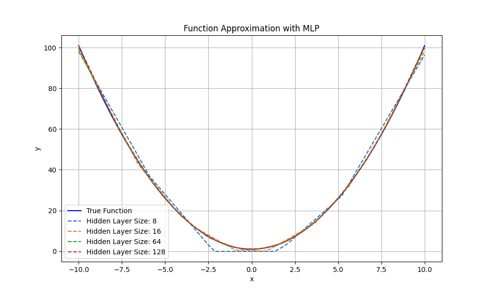
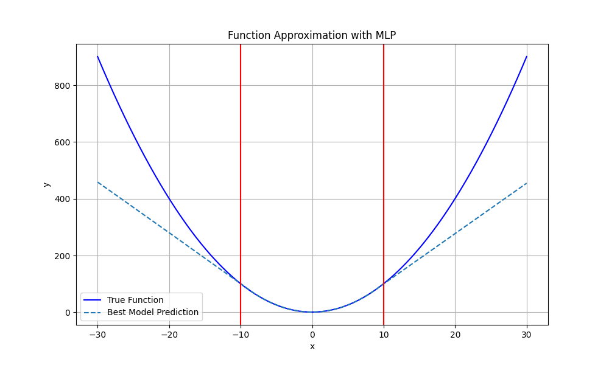
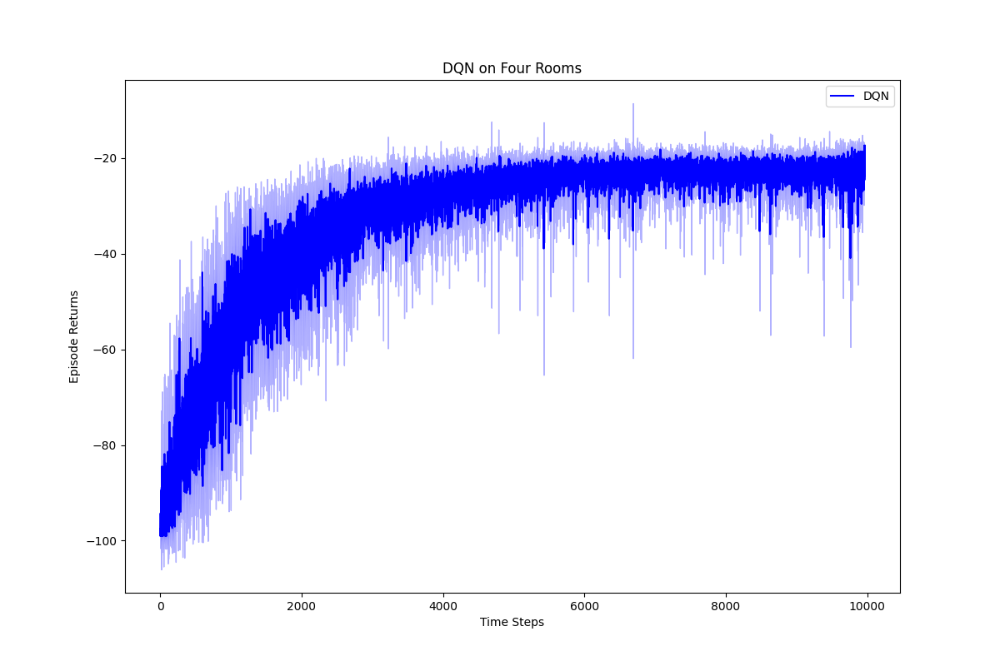
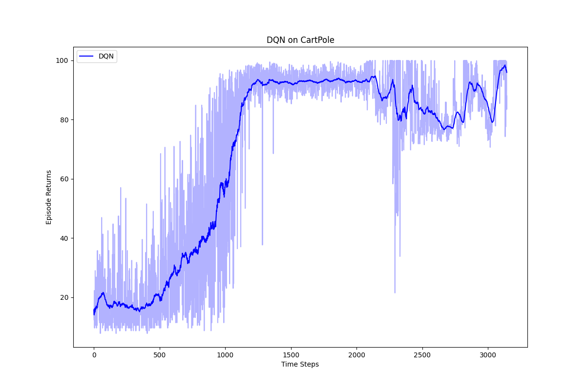
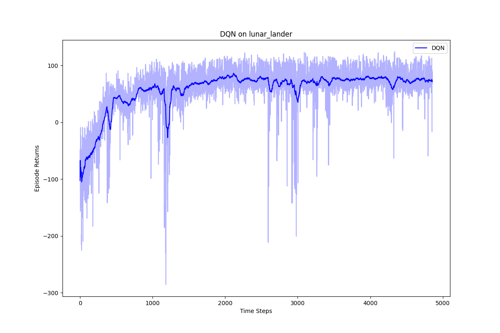

# HW7: DQN

## Q1: Nonlinear Function Approximation with Neural Networks

Within the bounds of the training data, the function approximation is very accurate. From this figure, it is clear to see that larger hidden layer sizes result in a much better representation of the nonlinear function. With larger hidden layer sizes, the number of learnable parameters increases. This increase in number of parameters allows for more flexibility during optimization allowing there to be a closer fit to the true function we are approximating. 

However, it is clear from this second plot that the approximated function cannot be extrapolated to inputs outside the range of the training data. It is clear that the approximated and true functions quickly diverge as we get out of the domain of the training data, marked with red lines. 

## Q2: Four Rooms DQN

Above is a plot showing the average per-episode return for each time step during training. As you can see, learning converges to an average episode return of about -22, meaning 22 steps taken, which is pretty good considering that the maximum upper bound is 20 steps assuming perfect transitions. 

The DQN Agent performs much better than the tabular methods, which took almost double the amount of steps to complete an episode

## Q3: Cart Pole and Lunar Landing

Above is a plot of the averaged Cart Pole Rewards during training.

Initially I performed training with only 500,000 time steps and the linear epsilon scheduler and the agent was able to keep the pole upright, however, it was not able to maintain a constant x position and would drift to out of bounds, terminating the episode earlier than desired. I tried many things like increasing the depth of the Q-Network or the number of nodes per layer. But this only made training worse. 

After switching to the exponential epsilon scheduler and training for 1,500,000 time steps, there was much better performance. The agent was able to keep the pole up and maintain a constant x position. 

[CartPole_Evolution.mov](plots/CartPole_Evolution.mov)

**0% (step 0):** With random initializations for the QNet, the policy is completely random, and as a result, the pole quickly falls, terminating the episode after only 10 steps.

**25% (step 374999):** After 25% training, the agent is able to keep the pole up, but there is a bit of drift in the cart.

**50% (step 749999):** After 50% training, there is still a little lateral drift but less than before.

**75% (step 1124999):** After 75% training, there is still drift but it seems to get dampend and the cart eventually comes to a stop.

**100% (step 1499999):** Finally, at the end of training, the agent is able to keep the pole up and the cart does not deviate in its x position. This is the most optimal policy in terms of reward maximization because the agent stays active for the entire episode until maximum time steps are reached for and the episode is terminated.

Above is a plot of the averaged Lunar Landing Rewards during training. Initially, I ran this training using only 500,000 training steps and using the linear scheduler for exploration. These initial results were very poor and there was very little learning. During playback it was clear that the agent was not able to land on the landing pad and would only land successfully occasionally. 

After increasing the training steps to 1,500,000 and switching to an exponential scheduler for exploration, the results were much better. As you can see, there is a nice learning curve with good convergence and a much higher average reward. When playing episodes during evaluation, pictured below, the lunar lander is able to consistently reach the landing pad as the number of steps increased.

[Lunar_Lander_Evolution.mov](plots/Lunar_Lander_Evolution.mov)

**0% (step 0):** With random initializations for the QNet, the policy is completely random, and as a result, the shuttle flys uncontrollably and crashes.

**25% (step 374999):** After 25% training, the agent is able to keep the shuttle stable in flight, maintaining a stable attitude, however the flight trajectory is still more or less random. It does not go in a straight path to the ground and does not land on the landing pad.

**50% (step 749999):** After 50% training, the agent flys the shuttle in a much more direct path, but still not perfectly direct with a softer landing, but it is not perfectly centered on the landing pad.

**75% (step 1124999):** After 75% training, the shuttle’s path is still not perfect, but it land in the middle of the landing pad.

**100% (step 1499999):** Finally, at the end of training, the agent steers the shuttle quickly to the ground and lands in the center of the landing pad. While performance is very good, it is technically not the optimal policy in terms of reward maximization. There is a bit of unnecessary propulsion, and flight deviation, as well as a slightly uncentered landing, which all contribute to a reduction in reward. But this is very close to the upperbound.